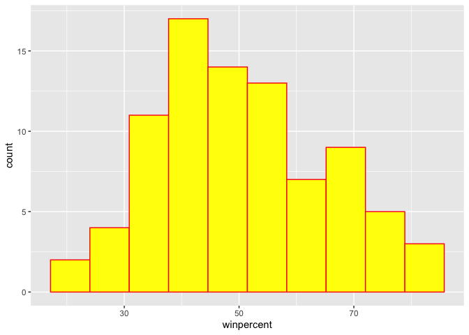
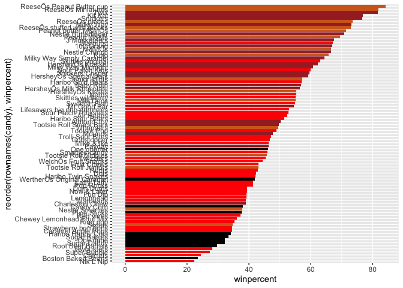
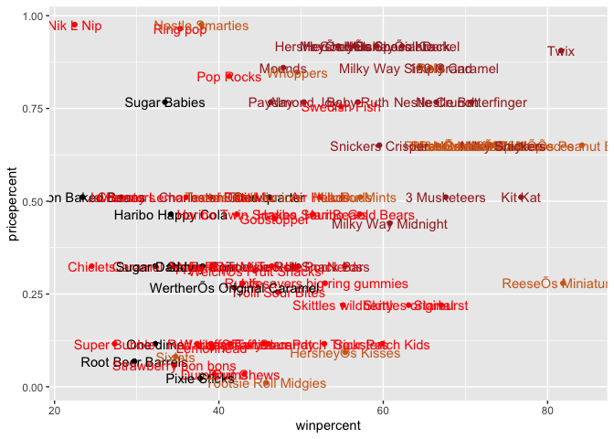
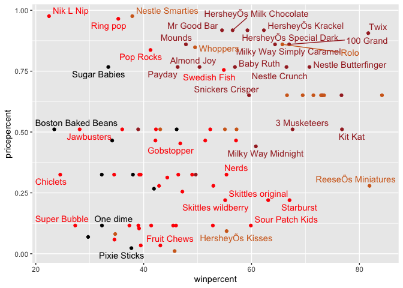
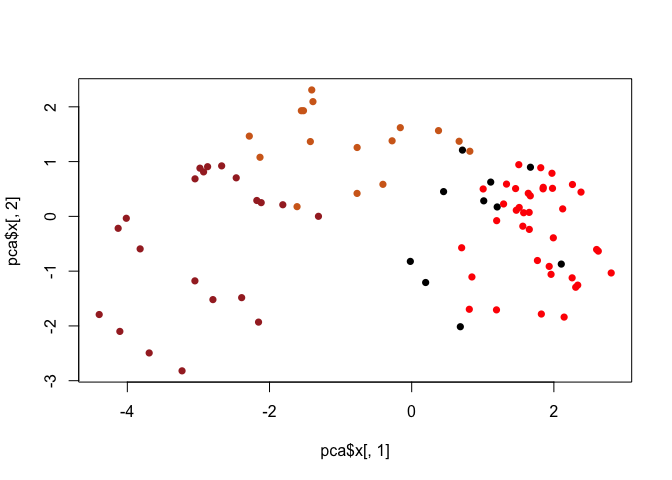
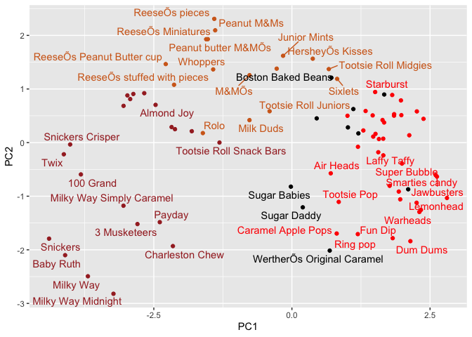

Class 10: Halloween Candy Mini Project
================
Barry

# Background

In this mini-project we will examine 538 Halloween Candy data. What is
your favorite candy? What is nougat anyway? And how do you say it in
America?

First step is to read the data…

``` r
candy <- read.csv("candy-data.csv", row.names=1)
head(candy)
```

                 chocolate fruity caramel peanutyalmondy nougat crispedricewafer
    100 Grand            1      0       1              0      0                1
    3 Musketeers         1      0       0              0      1                0
    One dime             0      0       0              0      0                0
    One quarter          0      0       0              0      0                0
    Air Heads            0      1       0              0      0                0
    Almond Joy           1      0       0              1      0                0
                 hard bar pluribus sugarpercent pricepercent winpercent
    100 Grand       0   1        0        0.732        0.860   66.97173
    3 Musketeers    0   1        0        0.604        0.511   67.60294
    One dime        0   0        0        0.011        0.116   32.26109
    One quarter     0   0        0        0.011        0.511   46.11650
    Air Heads       0   0        0        0.906        0.511   52.34146
    Almond Joy      0   1        0        0.465        0.767   50.34755

> Q1. How many different candy types are in this dataset?

``` r
nrow(candy)
```

    [1] 85

> Q2. How many fruity candy types are in the dataset?

``` r
sum(candy$fruity)
```

    [1] 38

``` r
candy["Twix", ]$winpercent
```

    [1] 81.64291

``` r
rownames(candy)
```

     [1] "100 Grand"                   "3 Musketeers"               
     [3] "One dime"                    "One quarter"                
     [5] "Air Heads"                   "Almond Joy"                 
     [7] "Baby Ruth"                   "Boston Baked Beans"         
     [9] "Candy Corn"                  "Caramel Apple Pops"         
    [11] "Charleston Chew"             "Chewey Lemonhead Fruit Mix" 
    [13] "Chiclets"                    "Dots"                       
    [15] "Dum Dums"                    "Fruit Chews"                
    [17] "Fun Dip"                     "Gobstopper"                 
    [19] "Haribo Gold Bears"           "Haribo Happy Cola"          
    [21] "Haribo Sour Bears"           "Haribo Twin Snakes"         
    [23] "HersheyÕs Kisses"            "HersheyÕs Krackel"          
    [25] "HersheyÕs Milk Chocolate"    "HersheyÕs Special Dark"     
    [27] "Jawbusters"                  "Junior Mints"               
    [29] "Kit Kat"                     "Laffy Taffy"                
    [31] "Lemonhead"                   "Lifesavers big ring gummies"
    [33] "Peanut butter M&MÕs"         "M&MÕs"                      
    [35] "Mike & Ike"                  "Milk Duds"                  
    [37] "Milky Way"                   "Milky Way Midnight"         
    [39] "Milky Way Simply Caramel"    "Mounds"                     
    [41] "Mr Good Bar"                 "Nerds"                      
    [43] "Nestle Butterfinger"         "Nestle Crunch"              
    [45] "Nik L Nip"                   "Now & Later"                
    [47] "Payday"                      "Peanut M&Ms"                
    [49] "Pixie Sticks"                "Pop Rocks"                  
    [51] "Red vines"                   "ReeseÕs Miniatures"         
    [53] "ReeseÕs Peanut Butter cup"   "ReeseÕs pieces"             
    [55] "ReeseÕs stuffed with pieces" "Ring pop"                   
    [57] "Rolo"                        "Root Beer Barrels"          
    [59] "Runts"                       "Sixlets"                    
    [61] "Skittles original"           "Skittles wildberry"         
    [63] "Nestle Smarties"             "Smarties candy"             
    [65] "Snickers"                    "Snickers Crisper"           
    [67] "Sour Patch Kids"             "Sour Patch Tricksters"      
    [69] "Starburst"                   "Strawberry bon bons"        
    [71] "Sugar Babies"                "Sugar Daddy"                
    [73] "Super Bubble"                "Swedish Fish"               
    [75] "Tootsie Pop"                 "Tootsie Roll Juniors"       
    [77] "Tootsie Roll Midgies"        "Tootsie Roll Snack Bars"    
    [79] "Trolli Sour Bites"           "Twix"                       
    [81] "Twizzlers"                   "Warheads"                   
    [83] "WelchÕs Fruit Snacks"        "WertherÕs Original Caramel" 
    [85] "Whoppers"                   

``` r
candy["Milky Way", ]
```

              chocolate fruity caramel peanutyalmondy nougat crispedricewafer hard
    Milky Way         1      0       1              0      1                0    0
              bar pluribus sugarpercent pricepercent winpercent
    Milky Way   1        0        0.604        0.651   73.09956

``` r
candy["Sour Patch Kids",]$winpercent
```

    [1] 59.864

``` r
candy["Dum Dums",]$winpercent
```

    [1] 39.46056

``` r
skimr::skim(candy)
```

|                                                  |       |
|:-------------------------------------------------|:------|
| Name                                             | candy |
| Number of rows                                   | 85    |
| Number of columns                                | 12    |
| \_\_\_\_\_\_\_\_\_\_\_\_\_\_\_\_\_\_\_\_\_\_\_   |       |
| Column type frequency:                           |       |
| numeric                                          | 12    |
| \_\_\_\_\_\_\_\_\_\_\_\_\_\_\_\_\_\_\_\_\_\_\_\_ |       |
| Group variables                                  | None  |

Data summary

**Variable type: numeric**

| skim_variable    | n_missing | complete_rate |  mean |    sd |    p0 |   p25 |   p50 |   p75 |  p100 | hist  |
|:-----------------|----------:|--------------:|------:|------:|------:|------:|------:|------:|------:|:------|
| chocolate        |         0 |             1 |  0.44 |  0.50 |  0.00 |  0.00 |  0.00 |  1.00 |  1.00 | ▇▁▁▁▆ |
| fruity           |         0 |             1 |  0.45 |  0.50 |  0.00 |  0.00 |  0.00 |  1.00 |  1.00 | ▇▁▁▁▆ |
| caramel          |         0 |             1 |  0.16 |  0.37 |  0.00 |  0.00 |  0.00 |  0.00 |  1.00 | ▇▁▁▁▂ |
| peanutyalmondy   |         0 |             1 |  0.16 |  0.37 |  0.00 |  0.00 |  0.00 |  0.00 |  1.00 | ▇▁▁▁▂ |
| nougat           |         0 |             1 |  0.08 |  0.28 |  0.00 |  0.00 |  0.00 |  0.00 |  1.00 | ▇▁▁▁▁ |
| crispedricewafer |         0 |             1 |  0.08 |  0.28 |  0.00 |  0.00 |  0.00 |  0.00 |  1.00 | ▇▁▁▁▁ |
| hard             |         0 |             1 |  0.18 |  0.38 |  0.00 |  0.00 |  0.00 |  0.00 |  1.00 | ▇▁▁▁▂ |
| bar              |         0 |             1 |  0.25 |  0.43 |  0.00 |  0.00 |  0.00 |  0.00 |  1.00 | ▇▁▁▁▂ |
| pluribus         |         0 |             1 |  0.52 |  0.50 |  0.00 |  0.00 |  1.00 |  1.00 |  1.00 | ▇▁▁▁▇ |
| sugarpercent     |         0 |             1 |  0.48 |  0.28 |  0.01 |  0.22 |  0.47 |  0.73 |  0.99 | ▇▇▇▇▆ |
| pricepercent     |         0 |             1 |  0.47 |  0.29 |  0.01 |  0.26 |  0.47 |  0.65 |  0.98 | ▇▇▇▇▆ |
| winpercent       |         0 |             1 | 50.32 | 14.71 | 22.45 | 39.14 | 47.83 | 59.86 | 84.18 | ▃▇▆▅▂ |

> Q6. Is there any variable/column that looks to be on a different scale
> to the majority of the other columns in the dataset?

winpercent

> Q8. Plot a histogram of winpercent values

``` r
hist(candy$winpercent)
```


``` r
library(ggplot2)

ggplot(candy) +
  aes(winpercent) +
  geom_histogram(bins=10, col="red", fill="yellow")
```



> Q11. On average is chocolate candy higher or lower ranked than fruit
> candy?

``` r
chocolate.inds <- as.logical(candy$chocolate)
chocolate.win <- candy[chocolate.inds,]$winpercent
mean(chocolate.win)
```

    [1] 60.92153

And for fruit candy…

``` r
fruit.inds <- as.logical(candy$fruity)
fruit.win <- candy[fruit.inds,]$winpercent
mean(fruit.win)
```

    [1] 44.11974

``` r
t.test(chocolate.win, fruit.win)
```


        Welch Two Sample t-test

    data:  chocolate.win and fruit.win
    t = 6.2582, df = 68.882, p-value = 2.871e-08
    alternative hypothesis: true difference in means is not equal to 0
    95 percent confidence interval:
     11.44563 22.15795
    sample estimates:
    mean of x mean of y 
     60.92153  44.11974 

# 3. Overall Candy Rankings

The base R `sort()` and `order()` functions are very useful!

``` r
x <- c(5,1,2,6)

sort(x)
```

    [1] 1 2 5 6

``` r
x[ order(x) ]
```

    [1] 1 2 5 6

``` r
y <- c("barry", "alice", "chandra")
y
```

    [1] "barry"   "alice"   "chandra"

``` r
sort(y)
```

    [1] "alice"   "barry"   "chandra"

``` r
order(y)
```

    [1] 2 1 3

First I want to order/arrange the whole dataset by winpercent values

``` r
inds <- order(candy$winpercent)

head(candy[inds,], n=5)
```

                       chocolate fruity caramel peanutyalmondy nougat
    Nik L Nip                  0      1       0              0      0
    Boston Baked Beans         0      0       0              1      0
    Chiclets                   0      1       0              0      0
    Super Bubble               0      1       0              0      0
    Jawbusters                 0      1       0              0      0
                       crispedricewafer hard bar pluribus sugarpercent pricepercent
    Nik L Nip                         0    0   0        1        0.197        0.976
    Boston Baked Beans                0    0   0        1        0.313        0.511
    Chiclets                          0    0   0        1        0.046        0.325
    Super Bubble                      0    0   0        0        0.162        0.116
    Jawbusters                        0    1   0        1        0.093        0.511
                       winpercent
    Nik L Nip            22.44534
    Boston Baked Beans   23.41782
    Chiclets             24.52499
    Super Bubble         27.30386
    Jawbusters           28.12744

# Barplot

The default barplot, made with `geom_col()` has the bars in the order
they are in the dataset…

``` r
ggplot(candy) + 
  aes(winpercent, rownames(candy)) +
  geom_col()
```


``` r
p <- ggplot(candy) + 
      aes(winpercent, reorder( rownames(candy), winpercent)) +
       geom_col()
```

``` r
ggsave("mybarplot.png", p)
```

    Saving 7 x 5 in image

``` r
p
```


Let’s setup a color vector (that signifies candy type) that we can then
use for some future plots. We start by making a vector of all black
values (one for each candy). Then we overwrite chocolate (for chocolate
candy), brown (for candy bars) and red (for fruity candy) values.

``` r
my_cols <- rep("black", nrow(candy))
#my_cols
my_cols[ as.logical(candy$chocolate) ] <- "chocolate"
my_cols[ as.logical(candy$bar) ] <- "brown" 
my_cols[ as.logical(candy$fruity) ] <- "red" 
my_cols
```

     [1] "brown"     "brown"     "black"     "black"     "red"       "brown"    
     [7] "brown"     "black"     "black"     "red"       "brown"     "red"      
    [13] "red"       "red"       "red"       "red"       "red"       "red"      
    [19] "red"       "black"     "red"       "red"       "chocolate" "brown"    
    [25] "brown"     "brown"     "red"       "chocolate" "brown"     "red"      
    [31] "red"       "red"       "chocolate" "chocolate" "red"       "chocolate"
    [37] "brown"     "brown"     "brown"     "brown"     "brown"     "red"      
    [43] "brown"     "brown"     "red"       "red"       "brown"     "chocolate"
    [49] "black"     "red"       "red"       "chocolate" "chocolate" "chocolate"
    [55] "chocolate" "red"       "chocolate" "black"     "red"       "chocolate"
    [61] "red"       "red"       "chocolate" "red"       "brown"     "brown"    
    [67] "red"       "red"       "red"       "red"       "black"     "black"    
    [73] "red"       "red"       "red"       "chocolate" "chocolate" "brown"    
    [79] "red"       "brown"     "red"       "red"       "red"       "black"    
    [85] "chocolate"

Now I can use this vector to color up my barplot

``` r
ggplot(candy) + 
  aes(winpercent, reorder( rownames(candy), winpercent)) +
  geom_col(fill=my_cols)
```



# 4. Taking a look at pricepercent

What about value for money? What is the the best candy for the least
money?

One way to get at this would be to make a plot of `winpercent` vs the
`pricepercent` variable.

``` r
ggplot(candy) +
  aes(winpercent, pricepercent, label=rownames(candy)) +
  geom_point(col=my_cols) +
  geom_text(col=my_cols)
```



This plot sucks! I can not read the labels… We can use ggrepl package to
help with this

``` r
library(ggrepel)

ggplot(candy) +
  aes(winpercent, pricepercent, label=rownames(candy)) +
  geom_point(col=my_cols) +
  geom_text_repel(col=my_cols, max.overlaps = 7)
```

    Warning: ggrepel: 45 unlabeled data points (too many overlaps). Consider
    increasing max.overlaps



# 5. Exploring the correlation structure

``` r
library(corrplot)
```

    corrplot 0.92 loaded

``` r
cij <- cor(candy)
corrplot(cij)
```


# PCA: Principal Component Analysis

The main function that always there for us is `prcomp()`. It has an
important argument that is set to `scale=FALSE`.

``` r
pca <- prcomp(candy, scale=TRUE)
summary(pca)
```

    Importance of components:
                              PC1    PC2    PC3     PC4    PC5     PC6     PC7
    Standard deviation     2.0788 1.1378 1.1092 1.07533 0.9518 0.81923 0.81530
    Proportion of Variance 0.3601 0.1079 0.1025 0.09636 0.0755 0.05593 0.05539
    Cumulative Proportion  0.3601 0.4680 0.5705 0.66688 0.7424 0.79830 0.85369
                               PC8     PC9    PC10    PC11    PC12
    Standard deviation     0.74530 0.67824 0.62349 0.43974 0.39760
    Proportion of Variance 0.04629 0.03833 0.03239 0.01611 0.01317
    Cumulative Proportion  0.89998 0.93832 0.97071 0.98683 1.00000

My PCA plot (a.k.a.) PC1 vs PC2 score plot.

``` r
plot(pca$x[,1], pca$x[,2], col=my_cols, pch=16) 
```



I will make a “nicer” plot with ggplot. ggplot only works with
data.frames as input so I need to make one for it first…

``` r
# Make a new data-frame with our PCA results and candy data
my_data <- cbind(candy, pca$x[,1:3])
```

``` r
ggplot(my_data) +
  aes(PC1, PC2, label=rownames(my_data)) +
  geom_point(col=my_cols) +
  geom_text_repel(col=my_cols, max.overlaps = 7)
```

    Warning: ggrepel: 40 unlabeled data points (too many overlaps). Consider
    increasing max.overlaps



``` r
summary(pca)
```

    Importance of components:
                              PC1    PC2    PC3     PC4    PC5     PC6     PC7
    Standard deviation     2.0788 1.1378 1.1092 1.07533 0.9518 0.81923 0.81530
    Proportion of Variance 0.3601 0.1079 0.1025 0.09636 0.0755 0.05593 0.05539
    Cumulative Proportion  0.3601 0.4680 0.5705 0.66688 0.7424 0.79830 0.85369
                               PC8     PC9    PC10    PC11    PC12
    Standard deviation     0.74530 0.67824 0.62349 0.43974 0.39760
    Proportion of Variance 0.04629 0.03833 0.03239 0.01611 0.01317
    Cumulative Proportion  0.89998 0.93832 0.97071 0.98683 1.00000
